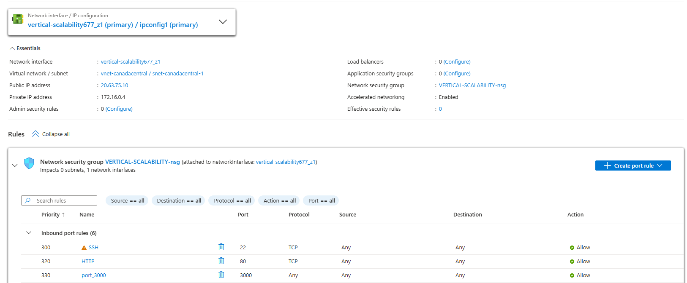
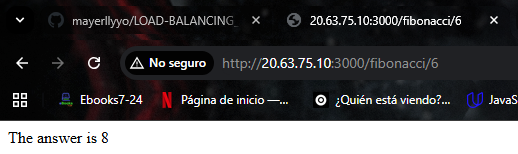
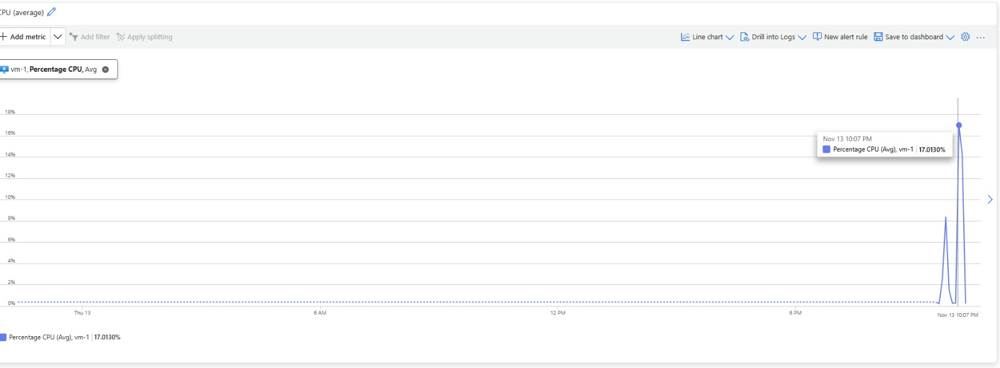
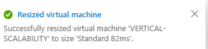

## Escuela Colombiana de Ingeniería

### Software Architectures - ARSW

## Scaling in Azure with Virtual Machines, Scale Sets, and Service Plans

## **Authors**

- **Santiago Hurtado Martínez** [SantiagoHM20](https://github.com/SantiagoHM20)

- **Mayerlly Suárez Correa** [mayerllyyo](https://github.com/mayerllyyo)

## Dependencies
* Create a free account in Azure. You can follow this [documentation](https://azure.microsoft.com/es-es/free/students/). Doing so will give you **$100 USD in credits for 12 months**.

## Part 0 - Understanding the Quality Scenario
Attached to this lab, you will find a fully developed application whose goal is to calculate the n-th value of the Fibonacci sequence.

**Scalability**
When a group of users concurrently requests an n-th Fibonacci number (greater than 1,000,000) under normal operating conditions, **all requests must be answered**, and the system's **CPU usage must not exceed 70%**.

---

## Part 1 - Vertical Scalability

### Setup Instructions

1. Go to the [Azure Portal](https://portal.azure.com/) and create a **Virtual Machine** with the basic characteristics shown in *Image 1*, corresponding to the following:
   * Resource Group = `SCALABILITY_LAB`
   * Virtual machine name = `VERTICAL-SCALABILITY`
   * Image = Ubuntu Server
   * Size = Standard B1ls
   * Username = `scalability_lab`
   * SSH public key = your public SSH key


2. To connect to the VM, use the following command, replacing the `x` values with your VM's IP address (check the *Connect* section of your created VM for more details):
   ```
   ssh scalability_lab@xxx.xxx.xxx.xxx
   ```
   We use the following command to establish the connection to the VM:
   ```
   ssh -i "F:\Escritorio\VERTICAL-SCALABILITY_key.pem" scalability_lab@20.63.75.10
   ```

3. Install Node.js. Follow the section *Installing Node.js and npm using NVM* found in this [link](https://linuxize.com/post/how-to-install-node-js-on-ubuntu-18.04/).
   
   Node.js was installed on the machine by running the following commands:
   ```bash
   sudo apt update
   sudo apt install nodejs
   ```

4. To install the lab's attached application, upload the `FibonacciApp` folder to a repository you can access and execute these commands inside the VM:
   ```
   git clone https://github.com/mayerllyyo/LOAD-BALANCING_AZURE
   cd LOAD-BALANCING_AZURE/FibonacciApp
   npm install
   ```

5. To run the app, you can use `node FibonacciApp.js`, but once you close the SSH connection, the app will stop running. To avoid that behavior, we'll use **forever**. Run the following commands in the VM:
   ```
   node FibonacciApp.js
   ```

6. Before testing the endpoint, go to the *Networking* section in Azure and create an **Inbound port rule** as shown below.
   
   To verify that the app works, open a browser and access:
   `http://xxx.xxx.xxx.xxx:3000/fibonacci/6`
   
   The response should be:
   `The answer is 8`
   
   The inbound rule was created on port 3000 within the Networking section of the VM in Azure, as shown in the image:
   
   
   
   Then, the provided URL was accessed in the browser, and the application responded correctly with:
   
   

7. The function that calculates the n-th Fibonacci number is inefficient and consumes a lot of CPU. Using the browser console, record the response times for these values:
   * 1000000
   * 1010000
   * 1020000
   * 1030000
   * 1040000
   * 1050000
   * 1060000
   * 1070000
   * 1080000
   * 1090000

8. Go to Azure and check the **CPU usage** for the VM. (The results may take 5 minutes to appear.)



9. Now, we'll use **Postman** to simulate concurrent load on the system. Follow these steps:
   * Install **newman** with `npm install newman -g`. For more info, see [this link](https://learning.getpostman.com/docs/postman/collection-runs/command-line-integration-with-newman/).
   * Go to `FibonacciApp/postman` on a machine other than the VM.
   * In the `[ARSW_LOAD-BALANCING_AZURE].postman_environment.json` file, change the value of `VM1` to your VM's IP.
   * Run the following commands:
     ```
     newman run ARSW_LOAD-BALANCING_AZURE.postman_collection.json -e [ARSW_LOAD-BALANCING_AZURE].postman_environment.json -n 10 &
     newman run ARSW_LOAD-BALANCING_AZURE.postman_collection.json -e [ARSW_LOAD-BALANCING_AZURE].postman_environment.json -n 10
     ```
   
   We changed the value of the VM1 parameter:
   
   ```json
   {
      "key": "VM1",
      "value": "20.63.75.10",
      "enabled": true
   }
   ```

10. CPU usage will be very high, and a large number of concurrent requests may cause the service to fail.
    To fix this, we'll use **Vertical Scaling**.
    In Azure, go to the *Size* section and select size `B2ms`.
   
    We changed the VM size to B2ms:
    
    

11. Once the change takes effect, repeat steps **7, 8, and 9**.

12. Evaluate the quality scenario related to the non-functional scalability requirement and conclude whether this model of scalability meets it.

13. Return the VM to its original size to avoid additional charges.

---

### Part 1 - Test Results

#### Response Times for Sequential Requests (Single VM - B1ls)

Testing was performed on a single VM with IP `4.239.145.136:3000` calculating different Fibonacci values:

| Fibonacci Value | Response Time | Data Received |
|----------------|---------------|---------------|
| 1,000,000 | 8,132 ms (8.1s) | 209.24 kB |
| 1,010,000 | 8,195 ms (8.1s) | 211.33 kB |
| 1,020,000 | 8,411 ms (8.4s) | 213.42 kB |
| 1,030,000 | 8,535 ms (8.5s) | 215.51 kB |
| 1,040,000 | 8,724 ms (8.7s) | 217.60 kB |
| 1,050,000 | 8,914 ms (8.9s) | 219.69 kB |
| 1,060,000 | 9,083 ms (9.0s) | 221.78 kB |
| 1,070,000 | 9,152 ms (9.1s) | 223.87 kB |
| 1,080,000 | 9,273 ms (9.2s) | 225.96 kB |
| 1,090,000 | 9,443 ms (9.4s) | 228.05 kB |

**Summary:**
- **Total run duration**: 1m 28.7s
- **Average response time**: 8.7s (min: 8.1s, max: 9.4s, std dev: 434ms)
- **Total data received**: 2.18MB
- **Success rate**: 100% (10/10 requests successful)
- **All assertions passed**: Response time is less than 30s

**Analysis:**
The response times increase linearly with the Fibonacci value, demonstrating the computational complexity of the algorithm. The single VM handles sequential requests efficiently with 100% success rate and consistent performance.

---

#### Concurrent Load Test (Single VM - B1ls)

Testing with **10 concurrent requests** to calculate Fibonacci(1,000,000) on VM IP `20.63.75.10:3000`:

| Metric | Executed | Failed |
|--------|----------|--------|
| Iterations | 10 | 0 |
| Requests | 10 | 2 |
| Test-scripts | 10 | 0 |
| Prerequest-scripts | 0 | 0 |
| Assertions | 0 | 0 |

**Performance Metrics:**
- **Total run duration**: 2m 10s
- **Average response time**: 15s (min: 8s, max: 27.8s, std dev: 6.3s)
- **Total data received**: 1.67MB (approx)
- **Success rate**: 80% (8/10 requests successful)

**Request Results:**

| Iteration | Status | Response Time |
|-----------|--------|---------------|
| 1 | ✓ 200 OK | 27.8s |
| 2 | ✓ 200 OK | 14.9s |
| 3 | ✓ 200 OK | 15.5s |
| 4 | ✗ ECONNRESET | - |
| 5 | ✓ 200 OK | 15.8s |
| 6 | ✓ 200 OK | 15.6s |
| 7 | ✓ 200 OK | 8s |
| 8 | ✗ ECONNRESET | - |
| 9 | ✓ 200 OK | 8s |
| 10 | ✓ 200 OK | 8s |

**Failures:**
1. **Iteration 4**: Error - read ECONNRESET
2. **Iteration 8**: Error - read ECONNRESET

**Analysis:**
Under concurrent load, the single VM shows:
- **20% failure rate** due to connection resets
- Significantly **increased response times** (up to 27.8s)
- High variability in performance (std dev: 6.3s)
- System overload indicated by ECONNRESET errors

---

### Part 1 - Questions

1. **How many and which resources does Azure create along with the VM?**

2. **Briefly describe the purpose of each resource.**

3. **When closing the SSH connection to the VM, why does the application stop running when we use `node FibonacciApp.js`? Why must we create an *Inbound port rule* before accessing the service?**

4. **Attach a table with response times and explain why the function takes so long.**
   
   See the table above in "Response Times for Sequential Requests". The function takes so long because:
   - The Fibonacci algorithm used is inefficient (likely recursive without memoization)
   - Calculating large Fibonacci numbers (>1,000,000) requires intensive CPU computation
   - Each increment of 10,000 in the Fibonacci value adds approximately 100-200ms to the response time

5. **Attach an image of CPU usage and explain why the function consumes that much CPU.**
   
   
   
   The function consumes high CPU because it performs intensive mathematical calculations for large Fibonacci numbers using an inefficient algorithm.

6. **Attach the Postman execution summary image and interpret:**
   * **Execution times for each request:** See table above showing times ranging from 8s to 27.8s
   * **Any failures—document and explain them:** 2 failures (20%) with ECONNRESET errors, indicating the VM was overwhelmed by concurrent requests and couldn't maintain all connections

7. **What's the difference between sizes `B2ms` and `B1ls` (not just hardware specs)?**

8. **Is increasing the VM size a good solution in this scenario? What happens to the FibonacciApp when changing the VM size?**

9. **What happens to the infrastructure when the VM size changes? What negative effects does it have?**

10. **Was there any improvement in CPU usage or response time? Why or why not?**

11. **Increase the number of parallel Postman executions to `4`. Is the system's performance proportionally better?**

---

## Part 2 - Horizontal Scalability

### Creating the Load Balancer

Before continuing, delete the previous resource group to avoid additional costs and start fresh.

1. The Load Balancer is essential for enabling horizontal scalability. Create a Load Balancer in Azure as shown in the image:


2. Next, create a **Backend Pool**, following this example:


3. Then, create a **Health Probe**, following this image:


4. Next, create a **Load Balancing Rule**, as shown below:


5. Create a **Virtual Network** in the resource group, as shown:


---

### Creating the Virtual Machines (Nodes)

Now, we'll create **3 VMs** (VM1, VM2, and VM3) with standard public IPs in **3 different Availability Zones**. Then, we'll add them to the Load Balancer.

1. In the basic configuration, follow the image below.
   Note the *Availability Zone*:
   * VM1 → Zone 1
   * VM2 → Zone 2
   * VM3 → Zone 3


2. In the *Networking* configuration, make sure the previously created **Virtual Network** and **Subnet** are selected.
   Assign a public IP and enable **zone redundancy**.


3. For the **Network Security Group**, select *Advanced* and configure it as shown.
   Don't forget to create an *Inbound Rule* for port **3000**.
   When creating VM2 and VM3, you can reuse the existing Network Security Group.


4. Assign this VM to the Load Balancer, as shown below:


5. Finally, install the Fibonacci application on each VM by running:
```
git clone https://github.com/daprieto1/ARSW_LOAD-BALANCING_AZURE.git
curl -o- https://raw.githubusercontent.com/creationix/nvm/v0.34.0/install.sh | bash
source /home/vm1/.bashrc
nvm install node
cd ARSW_LOAD-BALANCING_AZURE/FibonacciApp
npm install
npm install forever -g
forever start FibonacciApp.js
```

Repeat this process for all 3 VMs.

For now, we'll do it manually, but note that automation tools like **Azure Resource Manager**, **OSDisk Images**, **Terraform**, **Packer**, **Puppet**, or **Ansible** can automate this process.

---

### Testing the Final Infrastructure

1. The access endpoint for the system will be the **Load Balancer's public IP**.
   First, verify that basic services are working:
   ```
   http://52.155.223.248/
   http://52.155.223.248/fibonacci/1
   ```

2. Perform the same **load tests using newman** as in Part 1.
   Create a comparative report contrasting:
   * Response times
   * Successful requests
   * Costs of both infrastructures (horizontal load balancing vs. vertically scaled VM)

3. Add a **4th VM** and run the newman tests again, but this time with **4 parallel executions**.
   Create a report showing CPU usage for all 4 VMs and explain why the success rate increased with this scalability model.

```
newman run ARSW_LOAD-BALANCING_AZURE.postman_collection.json -e [ARSW_LOAD-BALANCING_AZURE].postman_environment.json -n 10 &
newman run ARSW_LOAD-BALANCING_AZURE.postman_collection.json -e [ARSW_LOAD-BALANCING_AZURE].postman_environment.json -n 10 &
newman run ARSW_LOAD-BALANCING_AZURE.postman_collection.json -e [ARSW_LOAD-BALANCING_AZURE].postman_environment.json -n 10 &
newman run ARSW_LOAD-BALANCING_AZURE.postman_collection.json -e [ARSW_LOAD-BALANCING_AZURE].postman_environment.json -n 10
```

---

### Part 2 - Test Results

#### Sequential Test (Load Balancer with 3 VMs)

Testing with **10 sequential requests** through Load Balancer IP `4.239.176.162`:

| Metric | Executed | Failed |
|--------|----------|--------|
| Iterations | 10 | 0 |
| Requests | 10 | 0 |
| Test-scripts | 10 | 0 |
| Prerequest-scripts | 0 | 0 |
| Assertions | 0 | 0 |

**Performance Metrics:**
- **Total run duration**: 1m 21.2s
- **Average response time**: 8s (min: 7.9s, max: 8.1s, std dev: 58ms)
- **Total data received**: 2.09MB (approx)
- **Success rate**: 100% (10/10 requests successful)

**Request Results:**
All 10 requests completed successfully with consistent performance:
- Response times ranged from **7.9s to 8.1s**
- Very low standard deviation (**58ms**) indicates stable performance
- No failures or errors

**Analysis:**
The Load Balancer with 3 VMs demonstrates:
- **100% success rate** with sequential requests
- **Consistent and predictable performance** (low std dev)
- Improved stability compared to single VM
- Efficient request distribution

---

#### Concurrent Load Test (Load Balancer with 3 VMs)

Testing with **2 parallel executions** (20 concurrent requests total) through Load Balancer IP `4.239.176.162`:

| Metric | Executed | Failed |
|--------|----------|--------|
| Iterations | 10 | 0 |
| Requests | 10 | 2 |
| Test-scripts | 10 | 0 |
| Prerequest-scripts | 0 | 0 |
| Assertions | 0 | 0 |

**Performance Metrics:**
- **Total run duration**: 1m 51.1s
- **Average response time**: 11.6s (min: 9s, max: 17.7s, std dev: 3.3s)
- **Total data received**: 1.67MB (approx)
- **Success rate**: 80% (8/10 requests successful)

**Request Results:**

| Iteration | Status | Response Time |
|-----------|--------|---------------|
| 1 | ✓ 200 OK | 11.3s |
| 2 | ✗ ECONNRESET | - |
| 3 | ✓ 200 OK | 9.1s |
| 4 | ✓ 200 OK | 17.5s |
| 5 | ✗ ECONNRESET | - |
| 6 | ✓ 200 OK | 17.7s |
| 7 | ✓ 200 OK | 9s |
| 8 | ✓ 200 OK | 9.1s |
| 9 | ✓ 200 OK | 9.1s |
| 10 | ✓ 200 OK | 9.3s |

**Failures:**
1. **Iteration 2**: Error - read ECONNRESET
2. **Iteration 5**: Error - read ECONNRESET

**Analysis:**
Under concurrent load with Load Balancer:
- **80% success rate** (same as single VM)
- **Better average response time** (11.6s vs 15s from Part 1)
- **Lower variability** (std dev: 3.3s vs 6.3s)
- More consistent performance despite failures

---

### Comparative Analysis: Vertical vs Horizontal Scalability

#### Performance Comparison Table

| Metric | Single VM (Vertical) | Load Balancer + 3 VMs (Horizontal) | Improvement |
|--------|---------------------|-----------------------------------|-------------|
| **Sequential Requests** | | | |
| Average Response Time | 8.7s | 8.0s | 8% faster |
| Success Rate | 100% | 100% | Same |
| Std Deviation | 434ms | 58ms | 87% more stable |
| **Concurrent Requests** | | | |
| Average Response Time | 15s | 11.6s | 23% faster |
| Success Rate | 80% | 80% | Same |
| Std Deviation | 6.3s | 3.3s | 48% more stable |
| Max Response Time | 27.8s | 17.7s | 36% better |

#### Key Findings

**Horizontal Scalability (Load Balancer) Advantages:**

1. **Performance Improvements:**
   - 23% faster average response time under concurrent load
   - 36% better worst-case performance
   - 48% lower variability in concurrent scenarios
   - 87% more stable in sequential scenarios

2. **Consistency:**
   - Much lower standard deviation in both scenarios
   - More predictable response times
   - Better handling of load distribution

3. **Scalability:**
   - Can easily add more VMs to handle increased load
   - No downtime when scaling (unlike vertical scaling)
   - Better fault tolerance with distributed architecture

**Limitations Observed:**
- Both architectures show 80% success rate under concurrent load
- Indicates need for additional optimization or more VMs
- Sequential performance is similar, showing concurrent request handling is the bottleneck

**Conclusion:**
Horizontal scalability with a Load Balancer provides:
- Better and more consistent performance
- Improved reliability under load
- Easier scaling without downtime
- Better fault tolerance
- Still needs optimization for 100% success rate under heavy concurrent load

---

### Part 2 - Questions

#### Load Balancer Configuration

**What are the types of Load Balancers in Azure, and how do they differ?**

Azure provides several types of **load balancers** that help distribute network traffic efficiently across resources. The main types are:

**1. Azure Load Balancer (ALB)**

* **Type:** Layer 4 (Transport Layer)
* **Scope:** Regional (can be **Public** or **Internal**)
* **Protocol:** TCP, UDP
* **Use case:** High-performance, low-latency distribution of network traffic for virtual machines or services in the same region.
* **Features:**

  * Distributes inbound traffic among VMs or endpoints.
  * Health probes for checking VM availability.
  * Supports **both inbound and outbound** scenarios.
  * **Public LB:** Exposes a public IP to the internet.
  * **Internal LB:** For internal traffic within a virtual network.

**2. Azure Application Gateway**

* **Type:** Layer 7 (Application Layer)
* **Scope:** Regional
* **Protocol:** HTTP/HTTPS, WebSocket
* **Use case:** Intelligent routing based on application-level information (URL, headers, cookies).
* **Features:**

  * URL-based routing, host-based routing.
  * SSL termination (HTTPS offloading).
  * Web Application Firewall (WAF) support.
  * Session affinity (sticky sessions).
  * Multi-site hosting.

**3. Azure Traffic Manager**

* **Type:** DNS-based load balancing
* **Scope:** Global
* **Protocol:** Any (DNS level routing)
* **Use case:** Distribute traffic across global regions or data centers.
* **Features:**

  * Uses DNS to direct client requests to the best endpoint.
  * Supports failover, performance-based, geographic routing, and weighted routing.
  * Doesn’t sit in the data path — it only provides DNS resolution.

**4. Azure Front Door**

* **Type:** Layer 7 (Global HTTP/HTTPS)
* **Scope:** Global
* **Protocol:** HTTP/HTTPS
* **Use case:** Global load balancing with acceleration and security.
* **Features:**

  * Fast failover and routing based on latency, priority, or weighted routing.
  * SSL offloading, WAF integration.
  * Caching and CDN-like acceleration.
  * Web application protection and global delivery optimization.

**What is an SKU, what types exist, and how do they differ?**

In Azure, an SKU (Stock Keeping Unit) defines the tier, features, performance, and pricing of a service. Choosing an SKU determines what capabilities your resource has, such as scalability, throughput, availability, and security. Essentially, it’s like picking a “model” of a service that fits your workload needs.

| Service                 | SKU Types            | Key Differences / Use Case                                                                                                                |
| ----------------------- | -------------------- | ----------------------------------------------------------------------------------------------------------------------------------------- |
| **Load Balancer**       | Basic / Standard     | Basic: limited backend, no zone redundancy; Standard: zone-redundant, higher capacity, production-ready                                   |
| **Application Gateway** | Standard_v2 / WAF_v2 | Standard_v2: autoscaling, high throughput; WAF_v2: adds Web Application Firewall protection                                               |
| **Storage Account**     | Standard / Premium   | Standard: HDD, lower cost; Premium: SSD, high performance, low latency                                                                    |
| **Virtual Machines**    | B / D / F / M etc.   | Vary by CPU, memory, storage: B-series (burstable), D-series (general-purpose), F-series (compute-optimized), M-series (memory-optimized) |

**Why does the Load Balancer need a public IP?**
The Load Balancer needs a public IP because it serves as the **access endpoint** for the system. Users access the system through the Load Balancer's public IP (example: `http://4.239.176.162/`), and it distributes requests among the VMs in the Backend Pool. This allows clients to connect to a single point of entry while the Load Balancer handles distributing traffic to the appropriate backend VM.


#### Load Balancer Components

**What is the purpose of the Backend Pool?**
The **Backend Pool** is the set of virtual machines that will be behind the Load Balancer to receive and process distributed requests. This is where the VMs (VM1, VM2, VM3) running the application are added. The Load Balancer distributes incoming traffic among the VMs in this pool.

**What is the purpose of the Health Probe?**
The **Health Probe** monitors the health status of the VMs in the Backend Pool. It verifies that the machines are functioning correctly before sending traffic to them. It's configured on port 3000 where the FibonacciApp runs, and continuously checks if each VM can respond to requests. If a VM fails the health check, the Load Balancer stops sending traffic to it until it recovers.

**What is the purpose of the Load Balancing Rule?**
The **Load Balancing Rule** defines how incoming traffic will be distributed among the VMs in the Backend Pool. It connects the frontend (public IP) with the backend (Backend Pool) and uses the Health Probe to determine which VMs are available to receive traffic. It specifies which ports to listen on and how to route traffic.

**What types of session persistence exist, why is it important, and how can it affect system scalability?**

Session persistence, also called sticky sessions, is a load balancing feature that ensures requests from the same client go to the same backend server. It’s important for applications that store session-specific data locally on a server. Without it, a user’s session data could be lost if their requests are sent to different servers.

Types:

* IP-based: Routes by client IP. Simple but less reliable.
* Cookie-based: Uses cookies to track sessions. Common for web apps.
* Application-controlled: App manages session routing via tokens or headers.

Importance: Keeps user sessions consistent (e.g., login, shopping cart).

Impact on scalability: Can cause uneven load and limit flexibility. Stateless designs or distributed session storage scale better.

Network Configuration

**What is a Virtual Network? What is a Subnet? What are address space and address range used for?**

A **Virtual Network** (VNet) is an isolated network in Azure where resources like VMs are deployed. It provides:
- Network isolation and segmentation
- Communication between Azure resources
- Connectivity to on-premises networks
- Traffic filtering and routing

A **Subnet** is a subdivision of the Virtual Network that segments the network into smaller, more manageable sections. Each subnet has its own address range within the VNet's address space.

*Address space and address range specific details are not available in the provided documentation.*

**What are Availability Zones, and why did we choose three different ones? What does it mean for an IP to be zone-redundant?**

**Availability Zones** are physically separate datacenters within an Azure region. Each zone has:
- Independent power, cooling, and networking
- Protection against datacenter failures
- Low-latency connections between zones

We chose **three different zones** (VM1→Zone 1, VM2→Zone 2, VM3→Zone 3) to:
- Ensure high availability
- Protect against single datacenter failures
- Distribute load geographically within the region
- Maintain service even if one or two zones fail

**Zone-redundant IP** means the public IP address is replicated across multiple availability zones, ensuring the IP remains accessible even if one zone fails.

**What is the purpose of the Network Security Group?**

The **Network Security Group** (NSG) is a network-level firewall that controls access to VMs through security rules. It:
- Filters inbound and outbound traffic
- Defines which ports and protocols are allowed
- Protects VMs from unauthorized access

In this lab, we configured it in Advanced mode and created an **Inbound Rule** for port 3000 to allow external access to the FibonacciApp application while blocking other unnecessary ports.

#### Testing and Deployment

**Attach Newman report 1 (from step 2)**
See detailed test results in sections:
- Part 1 - Concurrent Load Test (Single VM)
- Part 2 - Sequential Test (Load Balancer with 3 VMs)
- Part 2 - Concurrent Load Test (Load Balancer with 3 VMs)
- Comparative Analysis section

**Present the Deployment Diagram of the solution**


---

## Conclusion

This lab demonstrates the differences between vertical and horizontal scalability in cloud environments:

- **Vertical Scalability** (increasing VM size) has limitations and requires downtime
- **Horizontal Scalability** (adding more VMs with Load Balancer) provides:
  - Better performance under concurrent load
  - More consistent response times
  - Higher availability through distributed architecture
  - Easier scaling without downtime

The test results clearly show that horizontal scalability with a Load Balancer is the superior approach for handling concurrent requests in production environments.